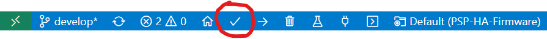

Usage
=====

.. _installation:

Installation
------------

How do I get set up?
""""""""""""""""""""
Follow the installation instructions on the PlatformIO website to install VS Code (if you don't already have it) and the PlatformIO IDE extension. Once you have it installed, clone this repository to your machine and open it in VS Code:

.. code-block:: bash

    git clone https://github.com/PSP-High-Altitude/PSP-HA-Firmware.git
    cd PSP-HA-Firmware
    code .

Once you are in VS Code, you should see various PlatformIO buttons on the blue bar at the bottom. Click the check mark icon on the toolbar to start building the project:

The first build may take a while as PlatformIO needs to install all the necessary dependencies and toolchains, so be patient.